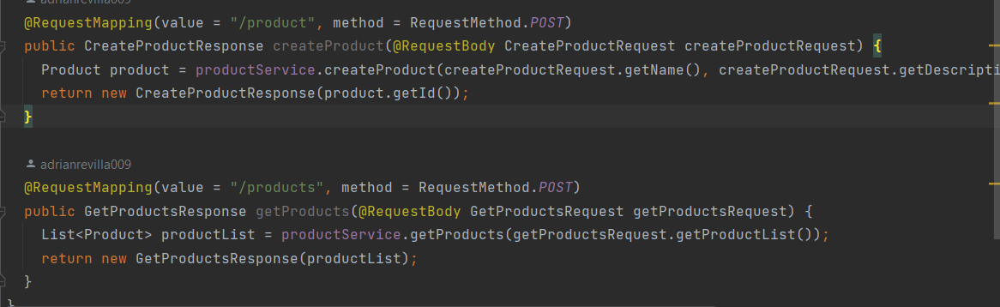
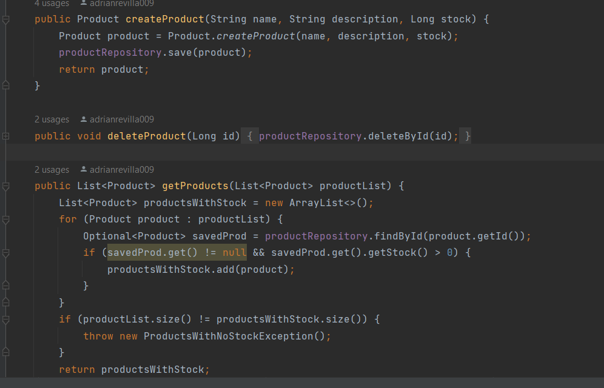
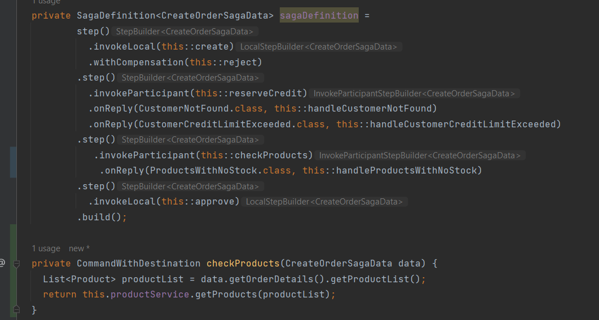
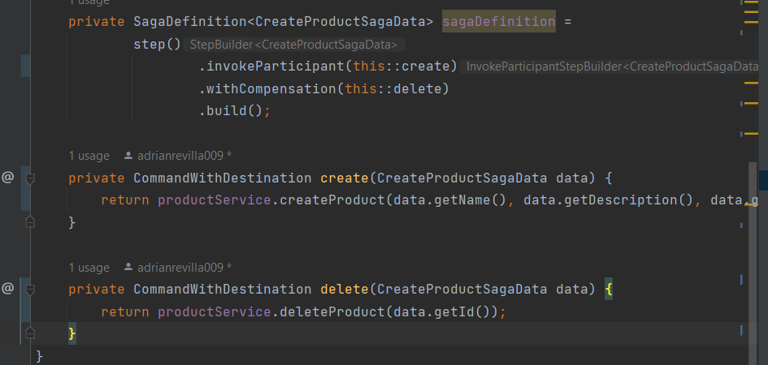
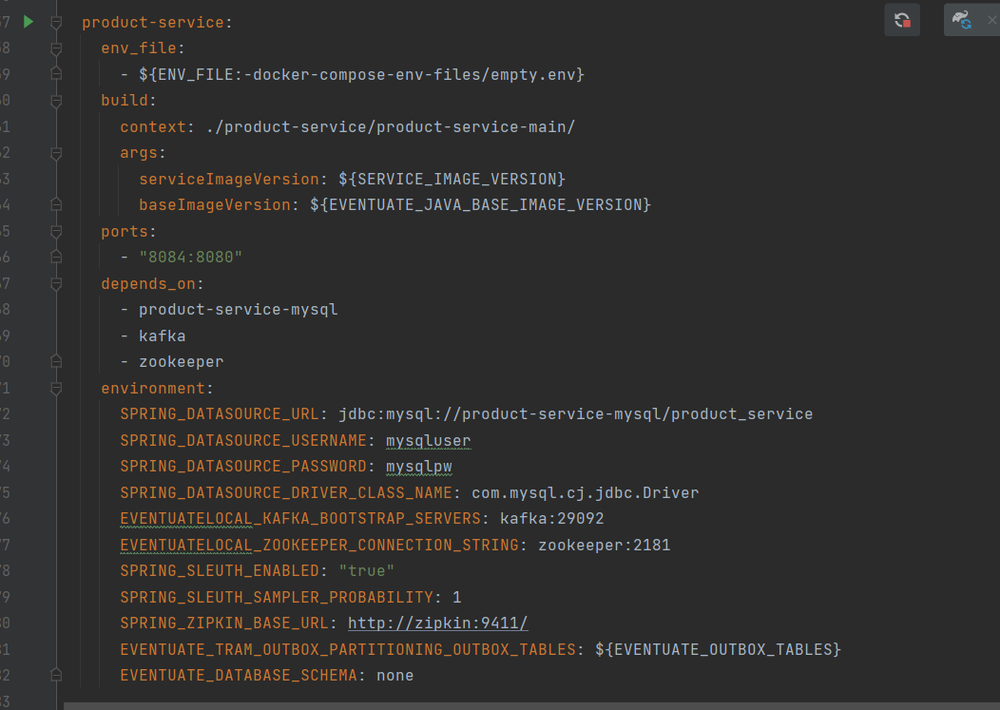
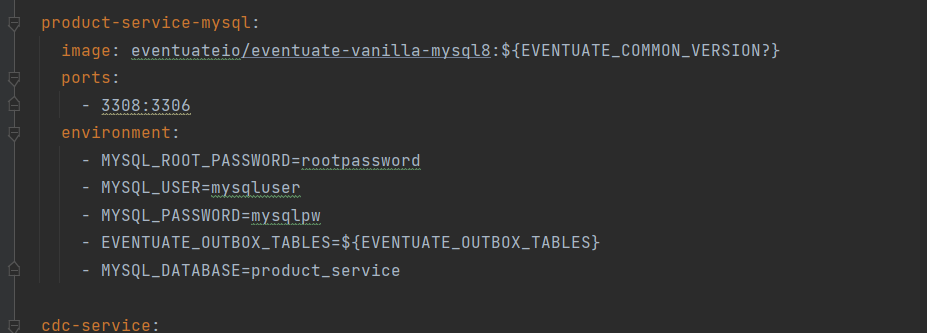
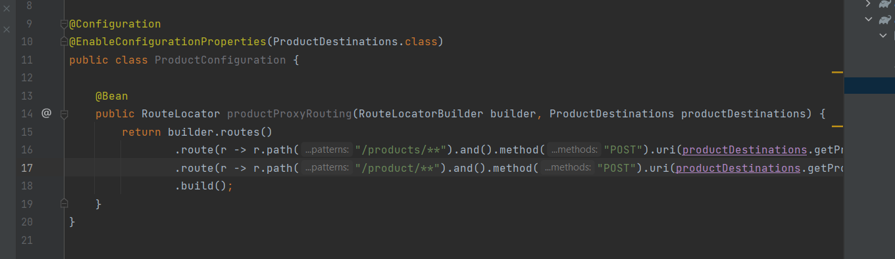
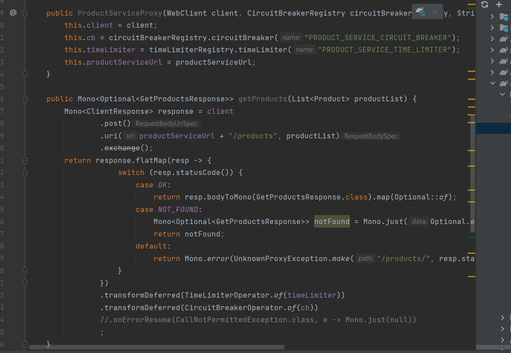
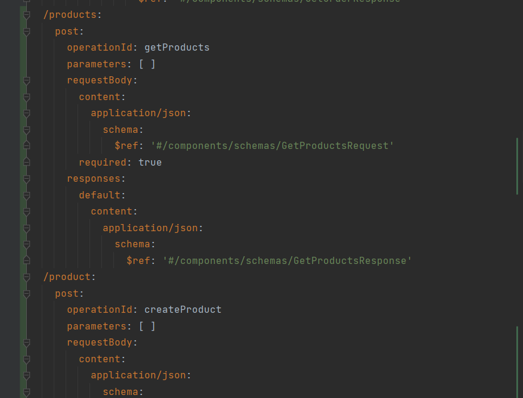
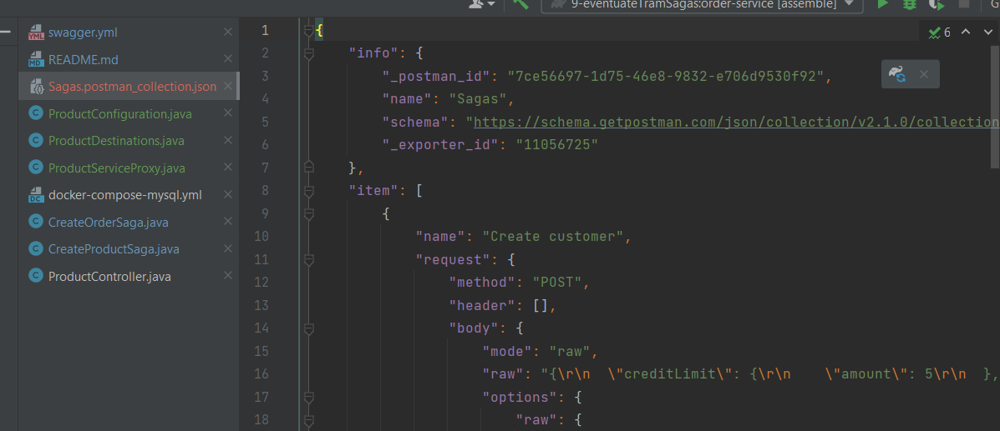

# eventuateTramSagas
Eventuate tram framework for saga management

Pasos a seguir para ejecutar los test

Test 1: Pedido correcto

1. Creamos un customer
$ curl -X POST --header "Content-Type: application/json" -d '{
   "creditLimit": {
   "amount": 5
   },
   "name": "Pepe"
}' http://localhost:8082/customers

2. Creamos un producto
$ curl -X POST --header "Content-Type: application/json" -d '{
   "name": "Leche",
   "description": "Entera",
   "stock": 10
}' http://localhost:8084/product

3. Hacemos un pedido
$ curl -X POST --header "Content-Type: application/json" -d '{
   "customerId": 1,
   "orderTotal": {
   "amount": 4
   },
   "productList": [
      {"id": 1, "name": "Leche", "description": "Entera", "stock": 5}
   ]
}' http://localhost:8081/orders

Test 2: Pedido rechazado porque falta el saldo del cliente
1. Creamos un customer
$ curl -X POST --header "Content-Type: application/json" -d '{
   "creditLimit": {
   "amount": 5
   },
   "name": "Juan"
}' http://localhost:8082/customers

2. Creamos un producto
$ curl -X POST --header "Content-Type: application/json" -d '{
   "name": "Yogurt",
   "description": "Limon",
   "stock": 10
}' http://localhost:8084/product

3. Hacemos un pedido
$ curl -X POST --header "Content-Type: application/json" -d '{
   "customerId": 2,
   "orderTotal": {
   "amount": 8
   },
   "productList": [
   {"id": 2, "name": "Yogurt", "description": "Limon", "stock": 5}
   ]
}' http://localhost:8081/orders

Test 3: Pedido rechazado porque falta el stock de producto
1. Creamos un customer
$ curl -X POST --header "Content-Type: application/json" -d '{
   "creditLimit": {
   "amount": 5
   },
   "name": "Pedro"
}' http://localhost:8082/customers

2. Creamos un producto
$ curl -X POST --header "Content-Type: application/json" -d '{
   "name": "Galleta",
   "description": "Chocolate",
   "stock": 10
}' http://localhost:8084/product

3. Hacemos un pedido
$ curl -X POST --header "Content-Type: application/json" -d '{
   "customerId": 3,
   "orderTotal": {
   "amount": 3
   },
   "productList": [
   {"id": 3, "name": "Galleta", "description": "Chocolate", "stock": 20}
   ]
}' http://localhost:8081/orders

Descripcion de la implementacion:
- Se ha añadido un nuevo microservicio product-service en el que hemos definido dos endpoints
  - GetProducts: Obtiene todos los productos con stock de una lista pasada por parametro
  - CreateProduct: Añade un nuevo producto

- Se definen los servicios con la logica de negocio

- Despues en el microservicio de orders que es el que hace de orquestador de la saga, 
para el getProducts no se ha definido un metodo de revocado ya que es un GET individual, y para el createProduct
se ha definido un metodo de borrado del producto generado en caso de haber un error en la transaccion
El primer servicio se ha incorporado dentro de la transaccion existente, ya que antes de aceptar una 
orden (que ahora tiene una lista de productos), debe comprobar si el stock restante es el correcto.

El segundo se ha implementado en una nueva transaccion con un metodo de compensacion

- Se han definido los recursos necesarios para poder levantar el nuevo microservicio junto a una nueva base de datos 
mysql en el manifiesto del docker-compose
  
- 
- Se han definido las nuevas rutas en el api-gateway para la redireccion a los endpoint del nuevo microservicio
  
  
- Se han incluido los nuevos endpoints en el esquema de open-api
  
- Se incluye el stack de peticiones en postman
  
